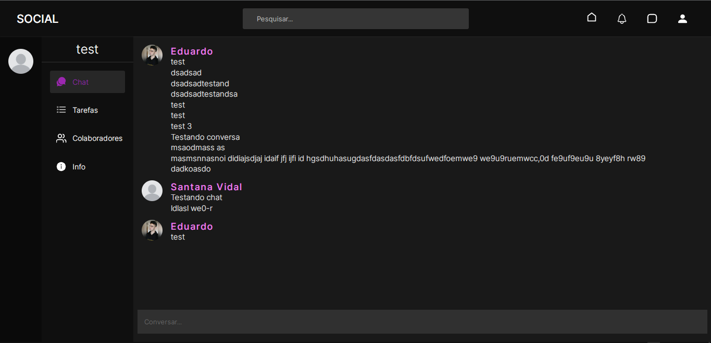
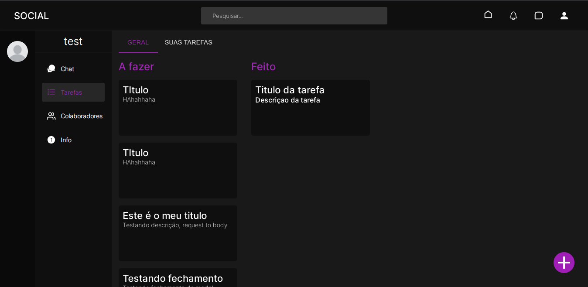
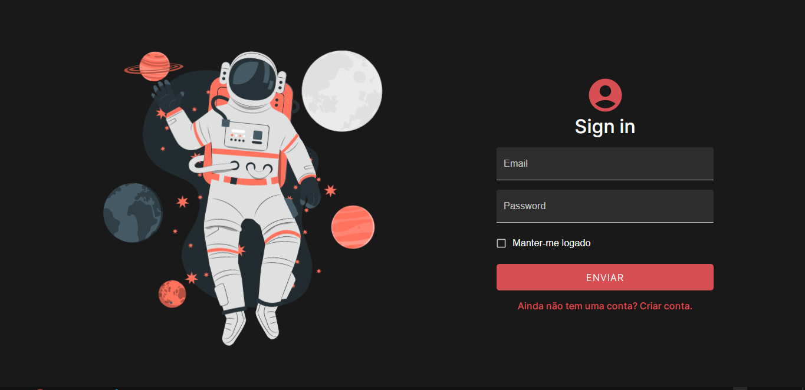
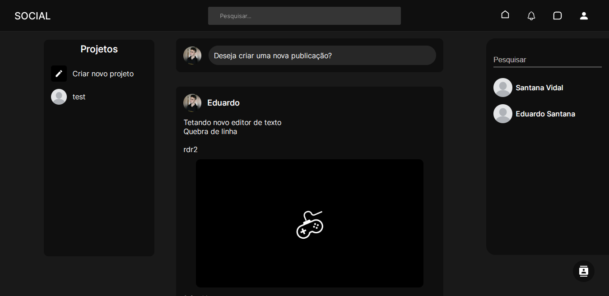
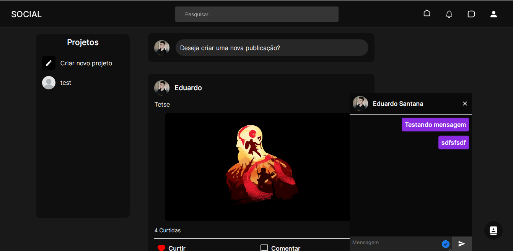
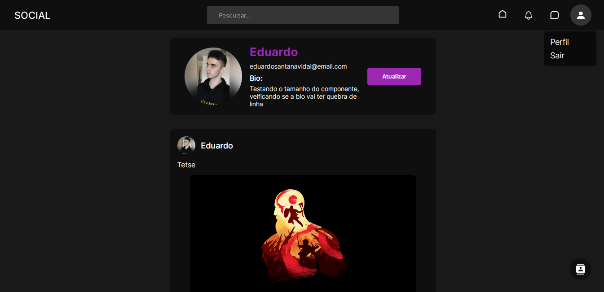
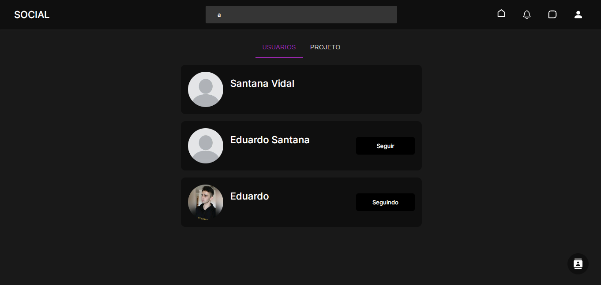
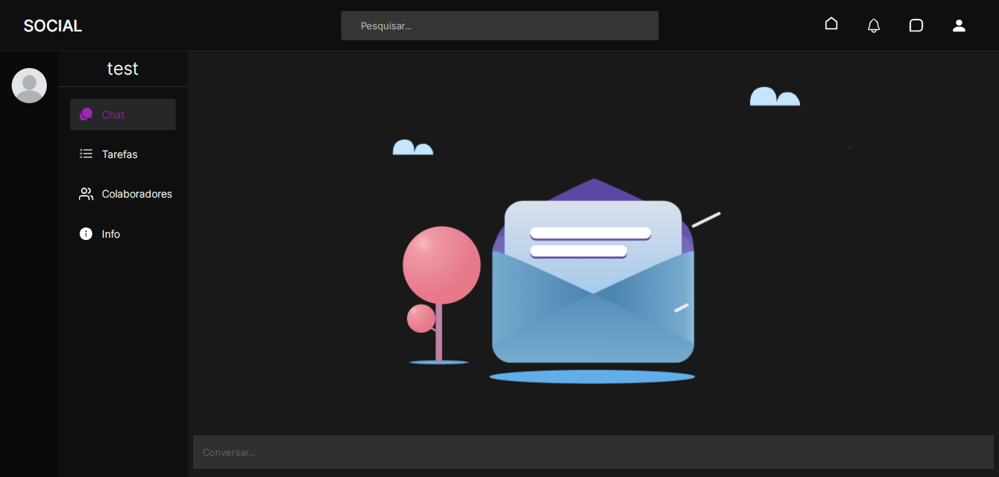

<h1 align="center">Rede social para projetos colaborativos</h1>

## Sobre
Uma rede social para trabalhos colaborativos, consiste em uma plataforma online que permite que o usuário possa encontrar projetos para contribuir, se conectar com outras pessoas que tem o mesmo propósito, consiga compartilhar as suas ideias, comunicar-se com outros usuários e gerenciar os seus projetos.

## Telas

## Funcionalidades
* Autenticação: O usuario pode se autenticar atravez do login ou criação de conta.
* Seguir: O usuario pode seguir outros usuarios.
* Gerenciar publicações: O usuario pode criar, consultar, remover ou atualizar publicações.
* Curtir e comentar: O usuario pode comentar ou curtir publicações.
* Feed: Carregar publicações de pessoas que o usuario segue.
* Chat: Enviar mensagens privadas para outro usuario.
* Criar e colaborar em projetos: Permite que o usuario possa criar os seus projetos e contribuir com os de terceiros.
* Chat do projeto: O projeto tem um chat geral onde todos os colaboradores podem discutir qualquer assunto.
* Gerenciar tarefas: Permite que o criador possa criar tarefas.

## Estrutura de pastas

### Backend
* Data: Implementações de caso de uso.
* Domain: Entidades e contratos de caso de uso.
* Infra: Classes relacionadas ao banco de dados.
* Main: Configurações do servidor, Rotas, Factories, Adapters e Middlewares.
* Presentational: Controller e helpers.
* Types: Tipos gloabais da aplicação.
* Validation: Schemas de validação.

### Frontend
* Components: Componenets reutilizaveis.
* Constants:  Variaveis imutaveis.
* Pages: Paginas do projeto.
* Service: Requisições a api.
* Shared: Arquivos compartilhados como: hooks, context, layout, types, schemas e helpers.
* Styles: Estilos globais da aplicação.

## Tecnologias utilizadas

### Backend
* NodeJs
* Postgresql
* Express
* Prisma
* Zod
* Typescript
* Socket.io

### Frontend
* ReactJs
* Material UI
* Styled-components
* Typescript
* Formik
* Yup
* Socket.io-client

